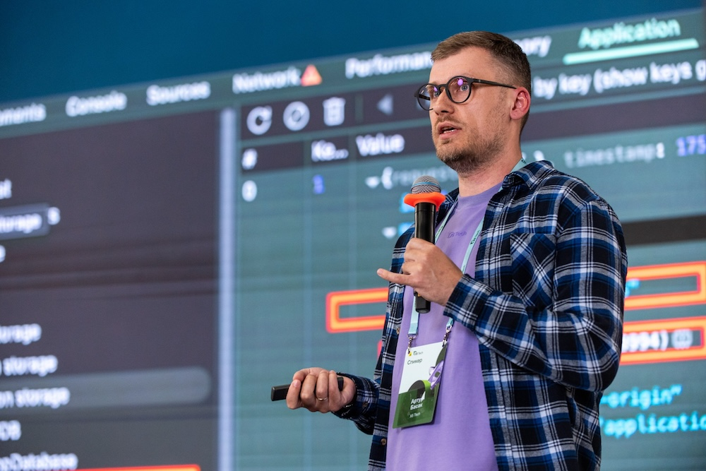

# Artur Basak Website

> Если коротко: это цифровой сад, лаборатория и персональный сайт в одной кодовой базе.

Персональный сайт, цифровой сад и инженерная песочница на `Next.js`.

Этот репозиторий давно вышел за рамки обычного `nextjs-boilerplate`. Сейчас это живая кодовая база, в которой совмещены несколько ролей:

- личный сайт и портфолио;
- digital garden с заметками, эссе и черновиками;
- набор интерактивных веб-инструментов;
- площадка для AI-экспериментов и быстрых продуктовых гипотез;
- техническая лаборатория для проверки идей в области accessibility, performance, security и UX.



## Зачем существует этот проект

Проект нужен не только как витрина опыта, но и как рабочее пространство, где можно:

- публиковать заметки и статьи без тяжёлой CMS;
- проверять идеи на реальном UI, а не только в изоляции;
- собирать маленькие полезные инструменты вокруг фронтенда и веб-платформы;
- экспериментировать с AI-функциями, автоматизацией и контентными сценариями;
- держать всё это в одной системе с едиными стандартами по архитектуре, UX и качеству.

Иными словами, это одновременно сайт автора, контентная платформа и песочница для инженерных экспериментов.

## Что находится внутри

### 1. Персональный сайт

Главная страница собирает ключевые блоки портфолио:

- hero-блок;
- about / skills;
- опыт;
- отзывы;
- сертификаты;
- blog;
- digital garden;
- набор инструментов;
- контакты.

Проект ориентирован на профессиональную подачу опыта веб-инженера и архитектора, но при этом не выглядит как статичное резюме.

### 2. Digital Garden

Раздел `garden` — это живой архив заметок, который обновляется по мере появления новых мыслей, наблюдений и эссе. Здесь есть материалы про:

- фронтенд и архитектуру;
- accessibility;
- дизайн-системы;
- тестирование;
- web performance;
- AI и влияние инструментов на профессию;
- личные технические наблюдения и культурный контекст вокруг разработки.

Содержимое заметок хранится в репозитории в `content/garden`, а сами изображения для статей лежат в `public/garden`.

### 3. Интерактивные инструменты

В проекте есть отдельный раздел `tools` и набор самостоятельных страниц с утилитами и демо. Среди них:

- генератор QR-кодов;
- генератор хэшей;
- конвертер в Braille;
- image placeholder tool;
- image optimizer;
- SVG optimizer;
- OCR;
- image to base64;
- time machine;
- алгоритмические и визуальные демо (`event loop`, `react fiber`, `timeline`);
- micro:bit connector;
- AI assistant.

Это не просто набор “виджетов ради виджетов”, а практические интерфейсы для экспериментов с браузерными API, обработкой данных, клиентской производительностью и UX-паттернами.

### 4. AI-песочница

Отдельная роль проекта — быть безопасной и удобной площадкой для AI-экспериментов.

## Технологии

### Основной стек

- `Next.js 16` на App Router;
- `React 19`;
- `TypeScript` со strict-подходом;
- `Tailwind CSS 4`;
- `Jest` + `Testing Library` + `jest-axe`;
- `ESLint` + `Prettier`;
- `Husky` + `lint-staged`.

## Структура проекта

```text
app/                 маршруты, страницы, API routes
components/          UI-компоненты и секции сайта
content/garden/      markdown-заметки digital garden
public/              статические ассеты, иллюстрации, ogp, картинки статей
lib/                 утилиты, доменная логика, i18n, security, garden parsing
constants/           константы и данные для контентных разделов
scripts/             вспомогательные скрипты для разработки и контента
__tests__/           unit, integration и a11y тесты
types/               локальные type declarations
```

## Локальный запуск

### Требования

- `Node.js` 20+;
- `npm`.

### Установка

```bash
npm install
```

### Разработка

```bash
npm run dev
```

По умолчанию приложение поднимается на `http://localhost:3000`.

### Полезные команды

```bash
npm run dev
npm run build
npm run start
npm run lint:check
npm run type-check
npm run test:ci
npm run garden:new
```
